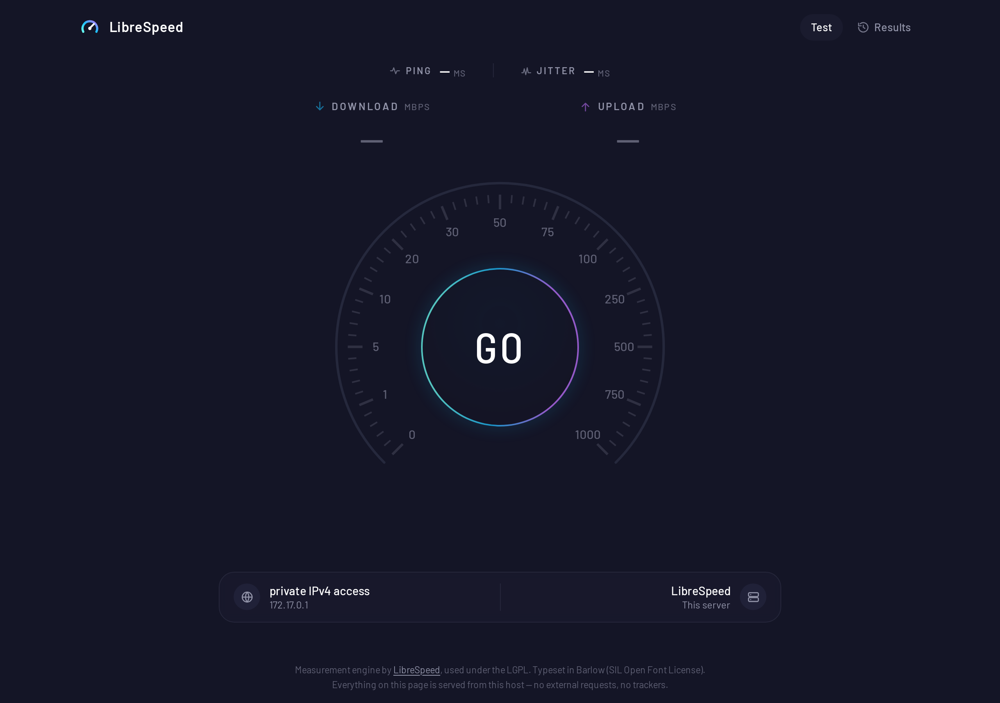
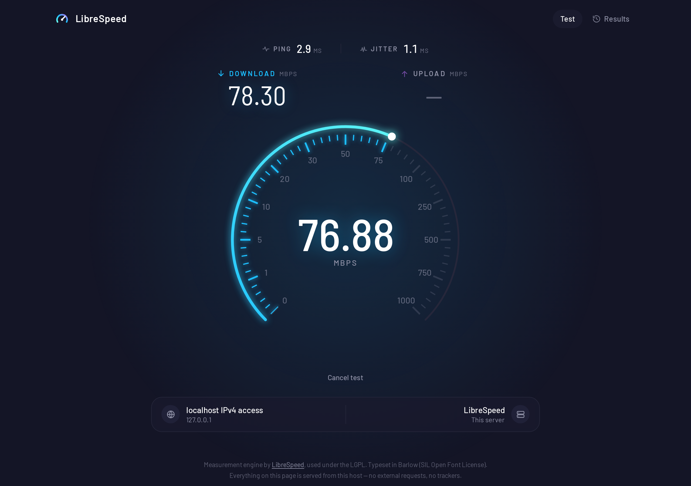
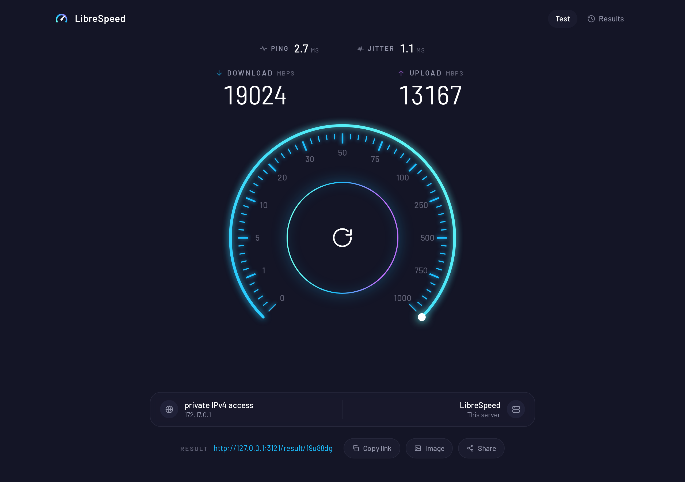
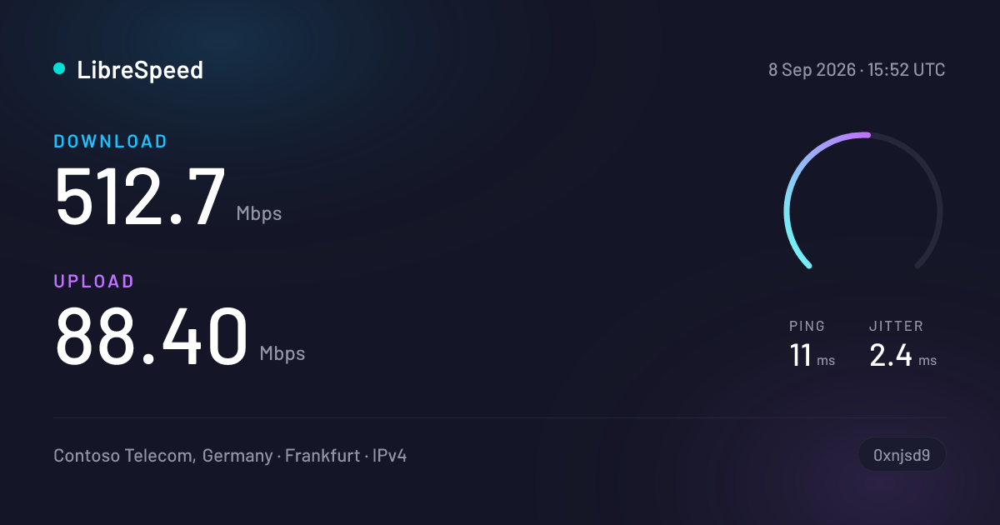

# LibreSpeed WebUI

A self-hosted internet speed test with the look and feel of Ookla's
Speedtest, built on **Next.js 15** and the **LibreSpeed** measurement engine.

It runs entirely on its own: the UI, the measurement endpoints, telemetry
storage and result sharing are all served by one process, and once built it
makes **no outbound connections at all** — no CDN, no web fonts, no analytics,
no IP lookup API. That is a design constraint rather than a preference, because
the intended deployment is an internal network with no route to the internet.



<table>
<tr>
<td width="50%"></td>
<td width="50%"></td>
</tr>
</table>

---

## What it does

- **Download, upload, ping and jitter**, measured by LibreSpeed's engine —
  multi-stream, grace-period-aware, with overhead compensation.
- **An animated dial** on Speedtest's non-linear scale, so a 30 Mbit link moves
  the needle as visibly as a gigabit one does.
- **Result telemetry** stored in SQLite, PostgreSQL or MySQL, on the schema
  LibreSpeed has always used.
- **Result sharing**: every stored run gets a short link, a server-rendered
  result page, and a share image that unfurls in anything reading Open Graph.
- **Multiple measurement servers**, ping-probed and selected automatically, with
  a manual override.
- **Per-browser history**, kept locally rather than by guessing at identity from
  an IP address.



---

## Quick start

### Docker

```bash
docker compose up --build
```

Then open <http://localhost:3000>. Results live in the `speedtest-data` volume;
keep it, or every restart invalidates previously issued share links.

### Local development

```bash
npm install
npm run dev          # http://localhost:3000
```

`npm run dev` starts the same custom server used in production (see
[Client addresses](#client-addresses)), so development behaves like the real
thing rather than diverging from it.

```bash
npm run build && npm start   # production build
npm run typecheck            # types only
```

Requires Node 18.18+ (Node 20 recommended, and what the image uses).

---

## How it is put together

```
app/
  page.tsx                     the test itself
  result/[id]/                 shared result page, share image, OG image
  results/                     per-browser history
  api/
    garbage/                   download source      (streams random bytes)
    empty/                     ping target and upload sink
    getIP/                     client address + offline ISP lookup
    telemetry/                 stores a finished run, returns a share id
    results/[id]/              a stored result as JSON
components/                    UI, one CSS module each
hooks/                         engine, server selection, clipboard
lib/
  gauge-scale.ts               the non-linear dial scale
  server/db.ts                 telemetry store (sqlite | postgres | mysql)
  server/obfuscation.ts        share-id scrambling, port of LibreSpeed's
  server/share-card.tsx        the share image
public/librespeed/             vendored LibreSpeed core (LGPL)
assets/                        read at runtime: ISP database, TTFs for the card
server.mjs                     thin HTTP server in front of Next
```

### Why the measurement core is vendored, not rewritten

`public/librespeed/speedtest.js` and `speedtest_worker.js` are LibreSpeed's,
carried over almost unchanged. The timing, grace periods, multi-stream
accounting and overhead compensation in those files are the genuinely hard part
of a speed test, and there is no reason for this project to have its own opinion
about them.

There is exactly one modification, marked in the file: upstream hardcodes the
worker URL relative to the page, and this app serves the core from
`/librespeed/`, so the URL is exposed as a settable property.

### What replaced the PHP backend

LibreSpeed ships a PHP backend. This project reimplements it in TypeScript as
Next route handlers, so there is one runtime instead of two:

| LibreSpeed (PHP)       | Here                    |
| ---------------------- | ----------------------- |
| `backend/garbage.php`  | `app/api/garbage`       |
| `backend/empty.php`    | `app/api/empty`         |
| `backend/getIP.php`    | `app/api/getIP`         |
| `results/telemetry.php`| `app/api/telemetry`     |
| `results/json.php`     | `app/api/results/[id]`  |
| `results/index.php`    | `app/result/[id]/image` |

The database schema and the share-id scheme are deliberately **unchanged**, so
an existing LibreSpeed telemetry database can be pointed at this app and keep
working — including its already-issued share links, provided the id salt comes
across with it (`SPEEDTEST_ID_SALT`).

---

## Configuration

Everything is environment variables, and — with one exception — they are read
per request, so a restart applies a change without a rebuild. See
[`.env.example`](.env.example) for the annotated full list.

| Variable | Default | Purpose |
| --- | --- | --- |
| `SPEEDTEST_BRAND_NAME` | `LibreSpeed` | Name in the header and on share cards |
| `SPEEDTEST_TELEMETRY` | `1` | Store results at all |
| `SPEEDTEST_TELEMETRY_LEVEL` | `basic` | `basic` / `full` / `debug` |
| `SPEEDTEST_SHARE` | `1` | Offer share links and images |
| `SPEEDTEST_REDACT_IP` | `0` | Replace stored addresses with placeholders |
| `SPEEDTEST_DB_TYPE` | `sqlite` | `sqlite` / `postgres` / `mysql` |
| `SPEEDTEST_DATA_DIR` | `./data` | Writable state: database, id salt |
| `SPEEDTEST_ISP_INFO` | `1` | Resolve ISP from the bundled offline database |
| `SPEEDTEST_ORDER` | `I_P_D_U` | Phase order: IP, ping, download, upload |
| `SPEEDTEST_DL_DURATION` | `15` | Seconds per download phase |
| `SPEEDTEST_UL_DURATION` | `15` | Seconds per upload phase |
| `SPEEDTEST_DL_STREAMS` | `6` | Concurrent download streams |
| `SPEEDTEST_SERVERS` | — | JSON array, or a path to one |
| `TRUST_PROXY` | `0` | Believe `X-Forwarded-For` / `X-Real-IP` |
| `NEXT_PUBLIC_BASE_PATH` | — | **Build-time only.** Serve from a subdirectory |

### Multiple servers

Point `SPEEDTEST_SERVERS` at a JSON array (see
[`servers.example.json`](servers.example.json)). Each entry names its own
endpoint paths, so a pool can mix instances of this app with existing LibreSpeed
PHP nodes. On load, every server is ping-probed and the closest is selected;
the user can override it from the connection bar.

Cross-origin servers must allow it. Both measurement endpoints emit permissive
CORS headers when a request carries LibreSpeed's `cors=true` marker, which the
engine adds automatically in multi-server mode.

---

## Notes on correctness

### Client addresses

Next route handlers receive a Fetch `Request`, which has headers but no socket —
there is no way to ask "who connected?" from inside a handler, which is what
PHP's `REMOTE_ADDR` gave the original backend for free.

`server.mjs` restores it: a thin HTTP server that stamps the TCP peer address
onto each request before Next sees it, having first deleted any value the client
tried to send under the same name. Forwarding headers are **stripped** unless
`TRUST_PROXY=1` says a proxy you control is terminating connections — otherwise
any visitor could choose the address recorded against their own result simply by
sending an `X-Forwarded-For` of their choosing.

This is also why the build does not use `output: "standalone"`: standalone
prunes `node_modules` to what Next's own generated server reaches, and a custom
server crashes on it.

### The download payload

`/api/garbage` streams cryptographically random bytes from a buffer allocated
once per process, and HTTP compression is disabled app-wide. Random data is
incompressible, so a negotiated `gzip` would put a compressor rather than the
network on the critical path and measure the server's CPU instead of the link.

The stream is filled on demand rather than pushed, so it drains at the socket's
pace and the client's progress events describe the network rather than a buffer.

### Verified against a known link

Measured through Chromium with its network emulator pinned to 75 Mbit down /
22 Mbit up, this build reported **78.58 / 23.48 Mbps** — the expected small
overshoot from LibreSpeed's 1.06 overhead-compensation factor. On loopback,
`/api/garbage` sustained roughly 58 Gbit/s and the upload sink about 8.5 Gbit/s,
so neither endpoint is the thing being measured on any realistic link.

### What is not implemented

LibreSpeed's PHP backend can estimate the distance to the client, using
coordinates from a third-party lookup service. That is an outbound call this
build cannot make, so distance estimation is off and the client is described by
address, ISP and country only. On a private network it is reported as
"private IPv4 access", which is the more useful answer anyway.

---

## Privacy

- Nothing is fetched from a third party. Fonts, the ISP database and the
  measurement core are all served from this origin.
- Result history is stored in the browser, not looked up by IP address — "my
  results" can only honestly mean "results from this browser".
- Telemetry stores what the run measured plus the client address; set
  `SPEEDTEST_REDACT_IP=1` to keep the measurements without the address.
- Share ids are scrambled, so results cannot be enumerated by counting upward.
  That is anti-enumeration, not access control: anyone with a link can read the
  result it points at.
- Pages are marked `noindex`.

---

## Licence and attribution

This project is **LGPL-3.0-or-later**, following the measurement core it builds
on. See [`LICENSE`](LICENSE) and [`NOTICE.md`](NOTICE.md).

- **LibreSpeed** by Federico Dossena — the measurement engine, vendored under
  the LGPL. <https://github.com/librespeed/speedtest>
- **Barlow** by Jeremy Tribby — SIL Open Font License 1.1. Used in place of
  Speedtest's proprietary typeface.
- **IP-to-ASN database** by ipinfo.io, CC BY-SA 4.0.

Not affiliated with, endorsed by, or derived from the code of Ookla, LLC.
"Speedtest" and "Ookla" are trademarks of Ookla, LLC; this project imitates the
*layout and feel* of a well-known interface, and ships none of its assets,
fonts, code or branding.
